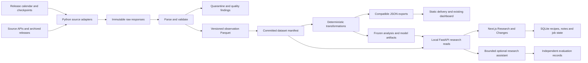
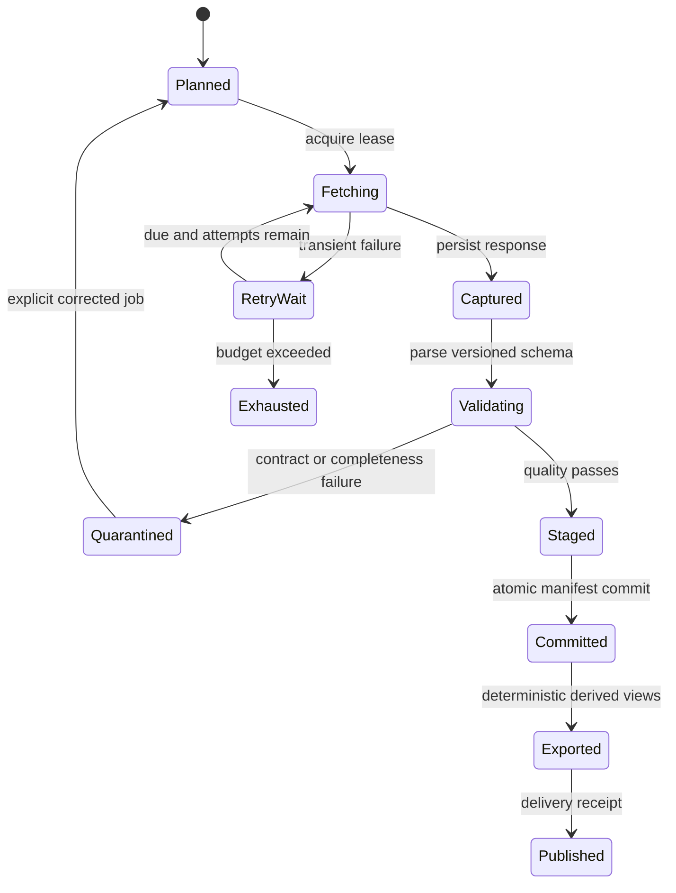

# Architecture and contracts

[Entry point](README.md) | [Research evidence](RESEARCH.md) | [Implementation](IMPLEMENTATION.md)

Everything in this document is a proposed design, not a description of deployed functionality. Provider facts and inspected code are documented in the research assessment.

## 1. System shape

Keep one Python codebase with adapters, deterministic transformations, query services and export jobs. Keep one Next.js application. Separate components by responsibility, not by service count.



DuckDB opens explicit Parquet file lists from a committed manifest. It is an analytical reader, not the durable transaction authority. SQLite is appropriate for one local installation's jobs, recipes and annotations. Immutable files preserve observations and analysis results. Team hosting replaces SQLite with Postgres for shared mutable state, while retaining Parquet/object storage and static delivery.

### Keep versus change

- Keep existing export URLs and payloads during migration. New fields are additive; new research endpoints live under `/api/v1/research`.
- Introduce an adapter result carrying raw evidence plus normalized rows. Keep `get_series` as a compatibility projection for current callers until migrated.
- Add `DatasetView` as an explicit input to calculation services. A computation must resolve its input snapshot once and never fetch a newer source mid-run.
- Keep scheduled batch updates. Release monitoring creates small ingestion jobs, not a streaming bus.
- Keep the current ledger intact. Import it into a legacy namespace with its original bytes/hash and known limitations. Never invent input hashes or publication times for old rows.

## 2. Temporal semantics

There are at least four relevant clocks: observation period, source availability, platform observation, and platform publication. Names must make these differences unavoidable.

| Field | Meaning |
|---|---|
| `period_start`, `period_end`, `source_period_label` | Economic time represented by a datum, including original quarterly/annual label |
| `source_available_date` | Source/provider vintage date, if evidenced |
| `source_available_at` | Exact timestamp only if separately evidenced; nullable |
| `availability_precision` | `timestamp`, `date`, `archive_edition`, `estimated_lag`, `unknown` |
| `availability_basis` | `original_release`, `provider_vintage`, `provider_first_seen`, `archive_metadata`, `assumed_lag` |
| `first_seen_at` | First successful platform capture containing this version; never backdated during historical import |
| `committed_at` | When a complete validated dataset manifest became eligible for platform queries |
| `computed_at` | When a deterministic analysis run finished |
| `published_at` | Publication event timestamp, backed by a receipt; `delivery_observed_at` separately records a successful public read |

Three query modes:

1. **Source as-of:** what can the available historical source evidence establish for a date? It may use archive evidence collected today, but must disclose its collection date and gaps.
2. **Platform as-of:** what committed dataset was available in this installation at a timestamp? Only manifests committed by then qualify. A backfill collected today cannot alter this answer for yesterday.
3. **Published analysis:** fetch the immutable artifact actually published under a particular run/release ID. Return no-record status if absent. Recomputing the old recipe is a separate operation.

Date-only FRED evidence supports an end-of-information-date interpretation. It does not support an arbitrary intraday cutoff. Intraday strict requests with only date precision fail with a coverage reason, unless the caller explicitly selects a conservative previous-completed-day policy. Store timezone and calendar policy; never convert an unknown release time into midnight UTC.

Coverage is a property of a series, region of history and evidence basis, not a single dataset-wide boolean:

```json
{
  "series_key": "fred:A191RL1Q225SBEA",
  "mode": "source_vintage",
  "verified_information_dates": ["2024-04-25", "2024-05-30"],
  "precision": "date",
  "complete_between_dates": false,
  "gaps": [{"reason": "vintage_enumeration_not_completed"}],
  "evidence_ids": ["capture:april", "capture:may"]
}
```

These IDs are illustrative. Real IDs are content-addressed. Other modes are `forward_capture`, `archive_edition`, `reconstructed_current_vintage`, and `unavailable`. A composite inherits the weakest required input coverage and discloses each exception. An observed lag approximation must never upgrade coverage to genuine point-in-time.

### Selection algorithm

For each series and observation period, select the newest eligible version by **source chronology**, within the requested information cutoff and verified coverage. When reconstructing platform knowledge, first restrict evidence to the pinned committed manifest. Resolve competing captures of the same source version explicitly: identical content deduplicates; conflicting values without an ordered correction are quarantined, not resolved by arbitrary file order.

An absent row is not automatically a deletion. Only a complete comparable source snapshot or an explicit provider retraction can produce a tombstone. An unchanged value can still carry changed units, seasonal adjustment or footnotes, so content identity includes semantic metadata. For initially simple snapshots, keep the whole snapshot and its scope. Add compact validity intervals only after proving equivalence, with half-open internal intervals and explicit conversion from provider-inclusive dates.

## 3. Data and state model

| Entity | Key and important fields | Invariants |
|---|---|---|
| `series_definition` | Stable UUID; provider, dataset/dataflow, full dimension map, geography, source ID, display aliases | Geography and unit basis are never inferred from filename; changing economics creates a new definition/version |
| `series_metadata_version` | Series ID + metadata hash; unit, multiplier, currency, frequency, adjustment, source notes, DSD hash, license policy | Old normalized rows retain their original metadata version |
| `capture` | Capture ID; sanitized request, response digest/object URI, status, timestamp, scope, parser version, provider headers | Exact response bytes are retained where permitted; never persist tokens, cookies or signed URLs |
| `observation_version` | Series ID + period + source-version/evidence identity; raw value text, numeric value, status, temporal fields, metadata hash | Do not deduplicate only by date; explicit null/retraction statuses; unit-safe arithmetic |
| `coverage_segment` | Series ID, observation range, information-date range/set, mode, precision, evidence refs, gaps | A successful HTTP response alone cannot mark a range complete |
| `ingestion_job` / `attempt` | Deterministic partition key; source/series/range/vintage, status, lease owner/generation, next retry, cursor, errors | Same requested partition can be retried without duplicating committed results |
| `dataset_manifest` | Hash, parent hash, sorted file hashes, row counts, quality report, coverage, catalog version | Visible only after all dependencies verify; readers pin exactly one manifest |
| `transform_definition` / `model_artifact` | Code commit + dirty patch hash if local, config hash, environment lock hash, parameters, fit cutoff, random seed, fitted object digest | No `model_revision=local` as a reproducibility identity; distinguish dirty work from a clean commit |
| `analysis_recipe` / `analysis_version` | Recipe ID and revision; typed expression tree, units, selected periods, as-of semantics, dataset manifest, model hash, author/time | Editing creates a version; refresh creates a run; opening a version never refreshes implicitly |
| `analysis_run` | Recipe version + inputs + environment + execution version; output hashes, timing, quality | Same inputs produce the same canonical values within declared tolerances |
| `publication` | Release ID, analysis IDs, committed manifest, artifact digests, publish event and delivery receipt | Failed computation/export cannot claim publication |
| `outcome_version` | Signal/publication ID, horizon, entry rule, market capture hashes, matured timestamp, values | Freeze first matured outcome; later price corrections create revisions, not silent updates |
| `annotation`, `watchlist`, `audit_event` | Owner/workspace IDs, record version, target artifact/series/period, actor and timestamp | An annotation remains attached to the referenced version; activity events cannot substitute for source lineage |

### File layout

```text
research-data/
  raw/sha256/<digest>                       # response bytes, compressed if appropriate
  captures/<capture-id>.json                # sanitized request and evidence envelope
  observations/<source>/<series-uuid>/<part-hash>.parquet
  metadata/<metadata-hash>.json
  manifests/<manifest-hash>.json
  analyses/<run-hash>/recipe.json
  analyses/<run-hash>/result.parquet
  analyses/<run-hash>/report.html
  publications/<release-id>.json
  current.json                             # pointer to a committed manifest
  control.sqlite                           # mutable local state, backed up separately
```

Partition according to observed scan and file sizes. Avoid one tiny file per observation; initially batch by source, series and ingestion partition. Identical response bodies can share storage, but retain capture events separately. Canonical logical-result hashes are distinct from byte-level Parquet hashes, which can change with writer versions.

## 4. Ingestion, release monitoring and recovery



1. Plan partitions from release events, vintage enumeration and a durable backfill cursor. Separate observation-range progress from vintage-range progress. Never use maximum observation date as the only checkpoint: old periods can be revised.
2. Rate-limit per provider, apply request deadlines, capped exponential backoff with jitter and Retry-After. A starting policy is four attempts and a two-minute overall budget per ordinary request; backfills have resumable partitions, not unlimited waits. Classify 401/403 as access issues, 429/5xx as retryable, schema errors as quarantine. Record status without secret-bearing exception URLs.
3. Persist successful raw bytes before parsing. Persist every page and validate page totals, returned scope and duplicate identities. If a paginated source changes during capture, use an upstream snapshot token where available; otherwise recheck metadata and retry or mark acquisition consistency uncertain.
4. Validate dimensions, frequency, units and missing markers before computing. Large revisions are warnings needing evidence, not automatically bad data. Identity/unit changes stop affected computations until reviewed.
5. Publish only complete validated partition manifests. Single local writer: lock, write temporary files, flush, atomically replace pointer on the same filesystem and commit job state. Recovery reconciles manifest IDs and job state if a crash falls between those writes. Object storage: immutable objects first, then conditional pointer update against prior version, with a fenced coordinator. Do not promise cross-store transactions.
6. Rerun a failed partition from its last committed cursor. Retry is at-least-once; hashes and unique logical partition keys make effects idempotent. A stale lease cannot replace the pointer after a newer generation wins. Backfills use lower priority than current releases.
7. Record quality failure and retain last-good public data with explicit age. Optional datasets can publish separate failed/partial statuses; required inputs to a composite cannot silently disappear or trigger weight redistribution.

Freshness separates `last_successful_poll`, `latest_observation_period`, `expected_release_at`, `release_observed_at`, `late_by` and `next_check_at`. Calendar records include timezone, source URL, version and observed cancellation/rescheduling. A source outage is different from a scheduled no-release day. Keep a coarse fallback polling cadence when the calendar itself fails.

Use overlap windows for routine updates plus scheduled full-history reconciliation where revisions can be arbitrarily old. A 30-day overlap is an optimization, never a completeness guarantee. FRED vintage enumeration catches older changes; BIS and World Bank source snapshots/archive editions need source-specific reconciliation. A resumed backfill must produce the same result as uninterrupted acquisition of the same frozen evidence.

## 5. Research UI and API

Desktop layout: catalog/search left, chart/table/recipe center, provenance inspector right. A persistent header shows **information date**, **data version**, and **saved or refreshed** status. Distinct comparison controls choose source-date comparison or model-version comparison. Keyboard access and data tables are first-class; charts need not encode status through color alone.

The catalog supports source, country, frequency, units and coverage filters. The recipe builder begins with allowlisted operations: difference, percentage change, annualized growth, rolling mean, z-score, spread and explicitly unit-checked arithmetic. Each operation shows parameters and missingness treatment. Advanced notebooks can consume the same frozen bundle, but arbitrary notebook execution is not exposed as a hosted feature initially.

**Changes** shows dependency-aware diffs for saved analyses. Compare `f_A(data_A)` with `f_A(data_B)` to isolate data effects; compare `f_A(data_B)` with `f_B(data_B)` to isolate transformation changes. For nonlinear models this is an ordered decomposition, not a unique causal attribution. Display the order and interactions rather than fabricating additive source contributions.

### Proposed endpoints

| Contract | Behavior |
|---|---|
| `GET /api/v1/research/series?q=&source=&country=&cursor=` | Catalog with stable IDs, units, rights and coverage; bounded page size |
| `GET /api/v1/research/series/{id}/observations?start=&end=&as_of=&basis=source&dataset=` | Explicit observation range and information date; optional immutable dataset pin. `basis=platform` accepts a timestamp and resolves a committed manifest |
| `GET /api/v1/research/series/{id}/vintages?cursor=` | Actual known versions with gaps and availability precision |
| `GET /api/v1/research/releases?from=&to=&watchlist=` | Expected and observed releases, visibly separate |
| `POST /api/v1/research/analyses` | Save typed recipe; returns recipe/version ID; `Idempotency-Key` deduplicates retries |
| `POST /api/v1/research/analyses/{id}/runs` | Resolve and pin inputs, enqueue deterministic computation, return 202 and job URL |
| `GET /api/v1/research/runs/{id}` | Immutable result metadata or current job state; GET never starts computation |
| `POST /api/v1/research/comparisons` | Compare two runs or rerun a fixed recipe with selected data version; explicit operation |
| `GET /api/v1/research/publications/{id}` | Exact previously published artifact, not a recomputation |
| `GET /api/v1/research/runs/{id}/export?format=csv` | CSV/JSON/Parquet or reproducibility bundle, enforcing rights |
| `POST /api/v1/research/annotations` | Version-targeted note; same workspace authorization as its target |

Example response shape, with illustrative IDs:

```json
{
  "schema_version": "1.0",
  "series_id": "fred:A191RL1Q225SBEA",
  "query": {"basis": "source", "as_of": "2024-04-25", "precision": "date"},
  "dataset_manifest": "sha256:example",
  "unit": "percent_qoq_saar",
  "coverage": {"mode": "source_vintage", "complete_for_query": true},
  "data": [{
    "period": "2024-Q1", "value": "1.6", "status": "observed",
    "source_available_date": "2024-04-25", "source_available_at": null,
    "evidence_id": "capture:example"
  }],
  "next_cursor": null
}
```

Use decimal strings for source values and unit-sensitive deterministic outputs; the UI converts only for plotting. The API documents rounding and float tolerances for models. Every response includes a manifest/version, coverage and provenance. Unknown historical completeness returns 422 `HISTORICAL_COVERAGE_UNAVAILABLE` in strict mode. Explicit partial mode returns gaps, never a silent current-vintage fallback. Empty observed periods return a successful empty dataset with a reason; missing resources return 404; expired retained artifacts return 410 with retention metadata; writes with a stale version return 409; bounded execution returns 202; throttling returns 429 with Retry-After.

Use OpenAPI-generated TypeScript types plus runtime response validation. Version cursors against a pinned manifest so pagination cannot mix releases. Set row/series/range and execution limits. No arbitrary filesystem paths or user SQL; compile typed expressions to parameterized queries. Immutable public responses use content hashes/ETags and long caching; the manifest pointer uses revalidation. Private responses never enter a shared public cache.

## 6. Reproducibility and the bounded research assistant

A saved bundle contains recipe, all required permitted input evidence or retrievable hashes, normalized rows, source/coverage metadata, transformation and model identities, exact dependency lock, Python/Node versions, platform/BLAS details, random seeds, calendar version, result hashes and a replay command. If license restrictions prevent distributing data, mark the bundle `requires_authorized_data` and explain which inputs must be reacquired. Do not advertise offline replay for an incomplete bundle.

Reports are versioned snapshots of a particular analysis run, with tables, chart specification, deterministic facts and separately labeled interpretation. Refresh produces a new report version and a change summary. Annotations and watchlists are user content; changing them does not rewrite source history.

The optional assistant receives allowlisted tools: catalog search, series read, run calculation, run comparison, retrieve release excerpts and inspect provenance. It cannot trade, publish, modify raw data, issue arbitrary SQL, execute Python, browse arbitrary URLs or access another workspace. Budget initially: eight tool calls and 60 seconds per question, with cancellation and a visible partial-result state. These are product defaults to test, not observed limits.

Numbers come from deterministic tool results with calculation IDs, units, periods and input hashes. Citation lookup resolves only actual evidence IDs. A validator checks every structured numeric claim against tool results before rendering. Unsupported explanations are labeled hypotheses or omitted. Retrieved text is untrusted content; it cannot grant new capabilities. Historical-mode retrieval excludes documents released after the selected information cutoff; later retrospective commentary is available only in a separate retrospective explanation mode.

Use `agent-eval-k3s` locally through a CLI/HTTP adapter or replay stored responses. Keep exact/subset contract checks and custom numeric/evidence checks independent of optional prose judging. Do not send goldens to the assistant. Include versioned test sets for wrong units, revised values, no historical coverage, malicious source text and cross-workspace requests. The agent's language model is not the calculator or the final numeric judge.

## 7. Personal installation and daily use

Initial deployment is Chris's Mac plus the existing public dashboard. Propose `make research-bootstrap`, `make research-demo`, `make research-dev`, `make research-refresh`, `make research-backup`, and a `macro` CLI. **These commands do not exist yet**; milestone acceptance requires implementing and testing them. Bootstrap creates isolated Python/Node environments from locks; demo installs only the small reviewed fixture; dev binds API to `127.0.0.1:8000` and UI to localhost. Keys stay in a local ignored environment file or Keychain.

Daily: read Today, inspect release status, open a saved analysis, review pending changes, explicitly refresh a copy, annotate, then export a pinned result. The application keeps working against the last committed dataset offline. Refresh is an explicit local read-only source fetch, never a production publication. A Mac sleeping misses release windows; capture metadata must admit this. Optional `launchd` scheduling can help routine updates but cannot guarantee continuous monitoring while asleep.

Back up immutable artifacts and the SQLite snapshot together using a manifest ID. Test restore to a new directory. Never copy a live database file without a consistent SQLite backup operation. Separate scratch caches from retained evidence and expose disk usage before backfills.

## 8. Hosted progression and operational decisions

| Stage | Deployment | Reason and exit trigger |
|---|---|---|
| Personal prototype | Mac: Python + SQLite + Parquet/DuckDB; current Vercel/Pages unchanged | Lowest friction, offline research and no new recurring services |
| Durable personal history | Existing Actions for coarse scheduled ingest; S3-compatible private object storage for captures/manifests; authorized derived JSON on static CDN | Introduce only when unattended capture and durable backups are needed. One writer and conditional commit pointer; no shared SQLite file on ephemeral runners |
| Shared research | Vercel frontend; one containerized Python API plus worker process on a small managed host; managed Postgres control plane and object storage | Saved private state and concurrent users justify transactional service. Select provider using existing access, region and measured cost before provisioning |
| Enterprise pilot | Same modular application with OIDC/SSO, tenant policy, audit export, tested backup/restore and service objectives | Actual customer requirements justify stronger isolation and operations. Multiple compute workers only after queue or latency measurements |

Actions is not a release-time SLA. Retain the 12-hour coarse schedule until closer monitoring has demonstrated value; a persistent scheduler with missed-run reconciliation can later drive release-window polls. Do not provision a Kubernetes cluster to solve a timing problem.

Team model: `workspace_id` on every recipe, annotation, job, private artifact and retrieval document. OIDC sessions and roles `owner`, `editor`, `viewer`; authorize in the service and enforce row-level policies in Postgres. Object keys are not authorization; downloads require authorization and short-lived signed URLs. Shared public macro data can be physically deduplicated, but licensed/private sources retain per-workspace entitlements. Test tenant checks across search, caches, export, job results and agent retrieval.

Audit log includes actor, action, target/version, request ID, dataset/run hash and outcome, excluding credentials. Retention policy distinguishes licensed raw evidence, referenced analysis inputs, rebuildable caches and personal notes. Proposed personal default: retain referenced evidence indefinitely subject to rights, unreferenced captures for 12 months, caches for 30 days; explicit dry-run garbage collection only. Team retention is configurable and must coordinate backups, deletion requests and legal requirements before claiming compliance.

Release compatibility: deploy additive schema readers first, run shadow ingestion, validate candidate exports, then switch a manifest pointer. Include code SHA, schema version, dataset manifest and compute timestamp in exports. Roll back the pointer without deleting evidence. A new worker must verify schema compatibility before processing old jobs. Preserve old URLs through an adapter until their consumers migrate.

Proposed team pilot objectives: 99.5% successful authorized reads over 30 days, publication within 60 minutes after a successful source capture for ordinary partitions, RPO 24 hours for mutable notes, RTO four hours from a tested backup. Source delays are reported separately, not excluded silently. These objectives are unmeasured and must be costed before a hosted pilot. Source captures and published analyses need stronger recoverability than a disposable cache.

## 9. Decision register

| Decision | Chosen now | Reconsider when |
|---|---|---|
| Static delivery vs database on every request | Preserve static public views, add bounded research queries | Dynamic personalized data dominates actual use |
| SQLite vs Postgres | SQLite locally, Postgres only for shared control plane | Multiple users/writers need transactional coordination |
| Parquet manifest vs table-format platform | Immutable files plus one writer, explicit snapshots | Measured file-count, concurrency or schema evolution burden exceeds maintenance budget |
| Orchestrator | Small resumable jobs in this Python codebase | Dependency graphs and operational failures justify Dagster/Prefect evaluation |
| Search | Exact identifiers and lexical metadata search | Benchmark shows semantic retrieval improves real questions |
| Forecasting | Fix historical eligibility and replay first | Held-out tests with appropriate baselines support a specific model experiment |
| Geography expansion | Validate a bounded useful series list | Current coverage and licensing pass, and a research question needs more |
| Agent | Optional tool-constrained interpretation | Deterministic data and citation checks are already reliable |

The design can grow, but neither this document nor a successful local demo establishes enterprise readiness.
