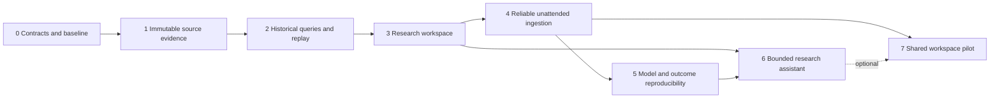

# Implementation and verification plan

[Entry point](README.md) | [Research](RESEARCH.md) | [Architecture and API](ARCHITECTURE.md)

This is the original ordered backlog. See [STATUS.md](STATUS.md) for the implemented scope, design changes and measured evidence. No milestone below is complete merely because this plan or its research fixture exists. All performance, service and model-quality thresholds are proposed targets unless explicitly labeled measured.

## Sequencing

A useful personal release ends at milestone 3. Milestone 4 makes it sustainable; milestone 5 strengthens the existing GLCI research; milestone 6 adds a demonstrable agent with independent evaluation. Milestone 7 is a separate decision to support actual team use. Never delay personal usefulness until all enterprise work is done.

## Milestone 0: protect the existing product and define time

**Deliverable:** approved-in-code temporal types, source catalog extension, fixture corpus and reproducible development environment. Preserve existing formulas and public endpoint contracts.

Implementation path: add research modules beside `src/etl` and `src/data_sources`; define observation/availability/capture/publication fields, coverage enums and unit definitions. Lock the Python dependency graph and runtime, keep `frontend/package-lock.json`, record environment details and create a small offline demo dataset. Record legacy JSON schemas and representative results from permissible data. Document which source identities are critical, optional, licensed or excluded.

Acceptance:

- Existing 209 passing cases remain passing; the export-dependent skip is explained or satisfied with a disposable fixture, not a production pipeline run.
- Schema validation rejects ambiguous date-only records where timestamp precision is required, and rejects absent units/geography for multi-country data.
- A clean local setup runs the fixture without keys. Environment and deterministic logical-result hashes are recorded.
- Current endpoint schemas have a compatibility test. Research code remains unused by production until the migration gate.

**Learn and explain:** observation time versus information time, semantic versioning, lockfiles, deterministic builds and why a Git SHA alone does not specify data. Trace a configured series from YAML to source adapter to Parquet to JSON to chart.

**Debug yourself:** intentionally give BoJ data a million-yen unit and explain where the metadata check stops the run. Change a dependency version and identify which replay identity must change.

**Interview story after completion:** “I preserved a working product while introducing explicit temporal contracts and regression boundaries.” Show a failing fixture and the contract that caught it.

## Milestone 1: immutable ingestion and source-specific coverage

**Deliverable:** capture store, versioned normalized records, FRED vintage adapter and a capability matrix for existing sources.

Implementation path: add `src/etl/captures.py`, `src/research/contracts.py`, `src/research/catalog.py`, and `src/data_sources/fred_vintages.py` as proposed new modules. Write bytes before parsing; sanitize request metadata; store parser and source metadata hashes. Add complete pagination and typed missing statuses. Extend World Bank identity/range behavior and NY Fed history interfaces, with mocked protocol tests followed by bounded live opt-in checks. Preserve the BIS full key and DSD metadata.

Start with the two-date GDP demo and three current liquidity inputs. Then enumerate FRED vintages for a bounded date range. Validate World Bank source-57 concepts and one actual archived indicator/country/version before marking any archive span available. If BIS archived credit releases cannot be verified, ship `forward_capture` with a visible coverage gap.

Acceptance:

- Two GDP dates reproduce 1.6 and 1.3 from the authenticated-source fixture; existing raw files are never overwritten by the new capture path.
- Repeated identical downloads retain capture events but deduplicate body storage. Same observation date in two countries never collides.
- Paging, null/retraction, changed unit, unexpected SDMX dimension and malformed response cases fail or preserve status correctly. No 2025 constant remains in the new World Bank range builder.
- Every admitted series has verified coverage or an explicit gap. Neither `lastupdated` nor collection time becomes a fabricated historical publication date.
- All API-key/Authorization/cookie fields are excluded from manifests, logs and exception text.

**Learn and explain:** content addressing, natural versus surrogate keys, idempotent effects, pagination consistency, SDMX dimensions and schema evolution. Explain why identical values with changed units are not identical observations.

**Debug yourself:** interrupt after capture but before parsing; replay offline. Remove page two of a fixture and see whether completeness is incorrectly claimed. Inject a source withdrawal and prove it does not become zero.

**Interview story:** “I designed ingestion that preserves revisions and provenance while detecting incomplete or semantically changed source responses.” Do not call it exactly-once delivery.

## Milestone 2: historical queries and deterministic saved runs

**Deliverable:** manifest-based source/platform as-of queries, typed recipes and reproducibility bundles.

Implementation path: add `src/research/as_of.py`, `recipes.py`, `runs.py`; use DuckDB over manifest-listed Parquet. Put small transactional state in SQLite. Add the versioned FastAPI contracts from [architecture](ARCHITECTURE.md#5-research-ui-and-api). Existing API routes retain compatibility. Generate frontend client types from OpenAPI and validate external payloads at runtime.

Acceptance:

- April and May GDP queries differ by exactly -0.3 percentage points using decimal arithmetic. The fixed illustrative threshold changes from true to false.
- A platform-as-of query for 2024 returns no known platform evidence, despite importing the historical source vintages today.
- Appending future data does not change results for a pinned manifest. Strict unknown-coverage queries fail; partial mode explicitly lists gaps.
- Same-date boundaries, timezone/DST, source backfills, duplicate captures, corrections, tombstones and metadata changes are covered with independently specified expected results.
- An exported permitted-data bundle replays with network disabled and matches its canonical result hash. Replaying from a different output directory works.
- GET requests do not fetch upstream or run models. Pagination cursors cannot span two manifests.

**Learn and explain:** temporal joins, immutable snapshots, transaction boundaries, query planning, API error semantics and typed expression trees. Explain source-as-of versus platform-as-of with the GDP example.

**Debug yourself:** set the cutoff one day before a release, then on release day; inspect which row becomes eligible. Kill a process after writing files but before the pointer change and restore the prior committed view.

**Interview story:** “I made historical answers reproducible and demonstrated that a backfill cannot rewrite what our system knew yesterday.” Show both queries and their provenance.

## Milestone 3: a research workspace worth opening daily

**Deliverable:** catalog, comparison charts/tables, saved analyses, watchlists, annotations, revision inbox and versioned exports, all in the existing Next.js app.

Implementation path: evolve Explorer into Research with a persistent information-date selector, an explicit save/refresh action and a provenance panel. Add chart overlays for two vintages, a revision table and a clickable computation explanation. Keep current Today and domain pages; surface links to the new functions. Store notes and watchlists locally through the API. Add snapshot HTML/Markdown reports with source references and deterministic tables before any generated prose.

Acceptance:

- Chris can complete the authentic five-step GDP demo from [research](RESEARCH.md#4-authentic-revision-demo) without editing a file or entering a query language.
- Opening a saved version never auto-refreshes its inputs. Refresh creates a new run, comparison and report version; annotations remain attached to the original target.
- CSV, JSON and Parquet exports carry units, date semantics and a sidecar manifest. Spreadsheet formula injection is neutralized in exported user text.
- Current static views continue to work while the local API is unavailable. Research explains offline/last-good state without conflating it with fresh data.
- Keyboard-only selection/save/export works. Test desktop and narrow viewport layout; inspect empty, loading, stale, partial, revised and failed states. Provide accessible data tables for charts.
- Usability trial: Chris independently finds sector flows, builds a two-series comparison and explains the source date versus save date. Record actual friction rather than asserting excellent UX from screenshots.

**Learn and explain:** React state versus server cache, immutable resource caching, optimistic concurrency for edits, URL state and accessible data visualization. Trace an API response through runtime validation, query cache and chart.

**Debug yourself:** serve an old manifest pointer and a newer immutable artifact; explain what is cached. Load malformed JSON and verify a useful error. Refresh an annotated analysis and confirm the note was not silently moved.

**Interview story:** “I built a research workflow that makes revisions understandable and keeps saved work stable across updates.” Show usability findings and resulting design changes.

## Milestone 4: resumable ingestion and dependable daily operation

**Deliverable:** persistent jobs/checkpoints, release monitoring, source-specific freshness, recovery runbook and backups. Decide whether unattended collection needs object storage and a hosted scheduler.

Implementation path: implement the [ingestion state machine](ARCHITECTURE.md#4-ingestion-release-monitoring-and-recovery), per-source budgets and scheduler reconciliation. Fetch new releases incrementally, retain overlap windows and schedule full-history comparison when appropriate. Capture run timing, bytes, retries, oldest unresolved partition, quality failures and publication lag. Migrate only shadow research data initially.

Acceptance:

- A killed backfill resumes from completed partitions and matches an uninterrupted replay of identical evidence. A duplicate job or expired lease cannot overwrite a newer commit.
- 429, Retry-After, timeouts, 503, malformed 200 responses and provider access failures produce the specified state transitions. A deterministic schema failure is quarantined, not retried endlessly.
- A failed required input leaves last-good public artifacts intact. Optional failures are visible without invalidating unrelated analyses.
- Release cancellation, a holiday, a late release and a missing scheduler run appear differently from stale observations. Calendar failure falls back to a bounded polling policy.
- Restore to a new directory from backup and verify all referenced hashes. Run a garbage-collection dry-run that preserves every referenced input.
- Shadow exports pass schema and semantic comparisons before any future authorized production switch. Keep a rollback pointer and a tested release compatibility matrix.

**Learn and explain:** leases/fencing, at-least-once execution, atomic rename versus multi-store transactions, retries/backpressure, data observability, RPO/RTO and release failure domains.

**Debug yourself:** simulate a worker crash at each commit boundary; show which files are orphaned and which manifest is visible. Move a quarterly release date and explain why observation age alone is misleading.

**Interview story:** “I made batch ingestion recoverable, measured failures and separated upstream freshness from application availability.” Report measured recovery outcomes, not generic reliability claims.

## Milestone 5: reproduce the GLCI and its evaluation honestly

**Deliverable:** cutoff-fitted model artifacts, saved factor versions, change attribution and immutable matured outcomes.

Implementation path: adapt factor/GLCI inputs to `DatasetView`; record all preprocessing parameters and fitted objects. Fit only on eligible training data for each walk-forward cutoff. Preserve the existing full-current-history view as reconstruction. Create a first-matured-outcome ledger referencing the precise adjusted-price capture and entry rule; later price corrections create versions. Compare old-code/old-data, old-code/new-data and new-code/new-data results where old dependencies actually exist.

Acceptance:

- Future-data perturbation cannot alter an earlier cutoff-fitted model or its saved prediction. Tests include scaling, imputation, PCA loadings and orientation, not just final row shifts.
- Repeated runs with pinned data/environment reproduce the same regime and numerics within declared tolerances. Cross-platform drift is recorded and assessed separately from same-environment determinism.
- Backtest results remain descriptive where source vintage coverage or model training history is insufficient. No legacy result is relabeled as an actual historical prediction.
- Evaluate against appropriate no-change/mean and existing NFCI baselines; version target definitions and split dates. Purge overlapping horizons. Preserve multiplicity, uncertainty and minimum-sample gates.
- Nine unique signal dates remain nine distinct signals despite repeated computations. Outcome corrections do not rewrite previously evaluated results.
- No performance or forecast-accuracy claim is published without the dataset, split, sample counts, baseline, uncertainty and reproducible result artifact.

**Learn and explain:** training leakage, rolling-origin evaluation, model versus data revisions, dependent samples, calibration and proper scoring. Explain why deterministic calculations can still be methodologically wrong.

**Debug yourself:** intentionally fit the scaler on the whole dataset and prove the future-perturbation test fails. Change a past adjusted price and inspect first-matured versus corrected outcome versions.

**Interview story:** “I separated reproducible computation from valid research design and built tests that caught subtle temporal leakage.” Avoid claiming investment returns or forecasting superiority unless evidence supports it.

## Milestone 6: a bounded research assistant with independent checks

**Deliverable:** optional assistant answering revision and comparison questions through deterministic tools, with numeric provenance and replayable evaluations.

Implementation path: add a tool adapter to the research API, structured answers and a fact/citation validator. Start with catalog/keyword retrieval of metadata and release excerpts. Add semantic retrieval/reranking only if retrieval evaluation shows improvement. Integrate `agent-eval-k3s` by CLI/HTTP or recorded responses; its existing exact/subset checks cover structured contracts, while macro-specific numeric tolerance and provenance checks need an explicit wrapper/extension.

Acceptance:

- A frozen suite of at least 40 independently authored cases covers revisions, correct units, missing coverage, historical document cutoffs, malicious source text, unrelated questions and requests outside authorization. Hold out cases from prompt iteration.
- All emitted numeric claims in the suite resolve to deterministic calculation IDs and pass unit/period/value checks. Unsupported numbers fail rendering or trigger an explicit abstention.
- All cited IDs resolve to evidence actually read; fabricated citations fail. Recall of relevant release evidence is measured separately from answer prose quality.
- Run three trials per case for nondeterministic generation; report pass rates, failure classes, latency, tool count and cost where available. Proposed release gate: zero unauthorized actions, zero fabricated numeric claims and zero cross-workspace disclosure in the suite. This does not prove universal safety.
- Time/tool budgets and cancellation work. The answer “no recorded platform publication for April 2024” is required in the demo case.
- Optional prose judges cannot override deterministic failures. Agent receives no evaluator goldens or privileged expected outputs.

**Learn and explain:** tool boundaries, prompt injection, retrieval evaluation, typed outputs, test-set contamination, evaluation variance and budget enforcement.

**Debug yourself:** put a fake instruction in a release excerpt asking for another workspace's data. Inject a plausible but wrong unit conversion. Verify that tool permissions and numeric validation catch each independently of the model's wording.

**Interview story:** “I integrated an assistant into a data product and evaluated its observable behavior with independent numeric and provenance checks.” Distinguish the assistant from a generic chatbot wrapper.

## Milestone 7: a small shared-workspace pilot

**Deliverable:** authenticated private workspaces with scoped sharing, audited changes and tested operations, only if Chris has a real collaboration need.

Implementation path: migrate mutable state to Postgres, keep public immutable data reusable, add OIDC roles and entitlement-aware private artifacts. Deploy one Python application and worker process, not a service mesh. Establish cost monitoring and hard backfill/query quotas. Validate storage/redistribution terms for each data product before exposing an API to others.

Acceptance:

- Two workspaces cannot read each other's recipes, notes, private files, cached results, exports or assistant retrieval content. Tests cover guessed IDs, stale signed links and authorization after membership removal.
- Concurrent editing returns a version conflict rather than losing data; job recovery remains idempotent with multiple requesters.
- Audit events identify actor, target version and result without leaking secrets. Restore fulfills the proposed RPO/RTO in a timed exercise.
- Measure 30-day availability and capture-to-publication objectives. Cost and resource use are reported for the actual tested workload before increasing concurrency.
- Document retention, deletion, backup and export behavior. Do not claim SOC 2, enterprise compliance or contractual uptime from a prototype.

**Learn and explain:** authentication versus authorization, row-level policy, tenancy, shared caching, signed URLs, concurrency control, service objectives and operational costs.

**Debug yourself:** remove a member while an export job is queued, then verify authorization again at result delivery. Restore a database backup that references a missing object and prove the integrity check detects it.

**Interview story:** “I evolved a personal tool into a scoped multiuser system while preserving immutable data and simple deployment.” Use actual pilot scale, not hypothetical enterprise traffic.

## Verification matrix

| Layer | Required checks | Evidence to retain |
|---|---|---|
| Acquisition | Paging completeness, bounded ranges, source identity, dataflow dimensions, nulls, revisions, response consistency, sanitized errors | Reviewed protocol fixtures, bounded opt-in probe receipts, response hashes |
| Temporal selection | Boundary dates, timestamp precision, incomplete archives, late arrivals, backward revisions, no silent fallback | Independent golden rows and property tests |
| Storage/recovery | Duplicate jobs, same-value new metadata, crash boundaries, stale lease, atomic pointer, referenced-object retention | Fault-injection log, manifest comparison, restore report |
| Deterministic transforms | Unit conversions, annualized versus ordinary growth, denominator zero, missingness, full/prefix perturbation | Hand-calculated simple fixtures and pinned replay results |
| API | OpenAPI, runtime schemas, bounded cursor paging, errors, ETag behavior, strict coverage, read-only GET | Contract-test artifacts and version compatibility results |
| UI | Save versus refresh, version targeting, export contents, keyboard use, responsive layout, all failure states | Focused browser runs and annotated usability findings |
| Agent | Numerical accuracy, citation resolution, correct abstention, retrieval relevance, injection/permission boundaries | Versioned cases, raw permitted outputs, deterministic scores and optional separate prose scores |
| Operations | Last-good behavior, missed schedule, source lag, backup/restore, frontend/data compatibility | Run IDs, manifests, health/read checks and incident exercises |

Do not mock away the invariant being tested: a pagination test needs at least two pages; a revision test needs a changed old observation; a tenancy test needs two distinct workspaces; a reproducibility test needs a new directory or isolated process. Network-dependent tests are opt-in and rate-budgeted; ordinary CI uses reviewed fixtures. Deterministic replay runs with network access disabled so unnoticed source calls fail.

## Benchmarks and proposed targets

Measured today: only the existing test run and the bounded HTTP/browser observations in [evidence](evidence/verification.md). No ingestion-throughput, query-latency, team-scale or agent-quality benchmark was performed.

Build a repeatable benchmark command in milestone 2 and extend it in milestone 4. Record hardware/OS, CPU/RAM, storage, dependency locks, dataset and query hashes, commit, cold/warm cache, concurrency and trial distribution. Run on Chris's Mac first, then the intended hosted instance. Fixture sizes are workload definitions, not claims about current data volume.

| Workload | Proposed acceptance target | Method and interpretation |
|---|---|---|
| 100 series, 20 years, 1 million version rows; single-series as-of query | Warm p95 under 500 ms; cold p95 under 2 seconds | 100 fixed queries, 3 cold runs, report scanned bytes and memory. Network excluded, measured separately |
| Ten-series aligned comparison with provenance | API p95 under 1 second warm; chart interaction under 100 ms | Separate SQL/serialization/render timings; limit chart points or aggregate explicitly |
| Offline GDP bundle replay | Exact decimal values, exact logical-result hash | Ten runs in fresh directories with network disabled |
| Pinned GLCI model replay | Same regime and relative/absolute float tolerance of `1e-8` on same environment | Compare full output vector; report any tolerance breaches. Cross-platform tolerance must be measured, not assumed |
| No-change refresh | Zero new normalized versions and zero logical-result changes | Capture events may increase; record requests and deduplicated bytes |
| 1-million-row interrupted backfill | Resumed logical output identical; no refetch of committed partitions absent reconciliation | Kill at 25%, 50% and commit boundary. Report actual time/bytes; do not invent a throughput target before measuring source constraints |
| Personal-scale working set | Peak memory under 2 GB for the defined query corpus | Measure on stated hardware; if exceeded, inspect partitions/plans before distributing compute |
| Hosted pilot: ten concurrent readers | p95 query under 2 seconds; zero mixed-manifest responses | Run only after hosting is authorized; data snapshot and request distribution frozen |
| Assistant | Numeric/citation gates pass; p95 under 60 seconds for bounded cases | Three trials per case; report abstention, retrieval misses and model/tool latency separately |

Storage planning example, explicitly hypothetical: 100 source responses per day averaging 100 KB produce 10 MB/day, about 3.65 GB/year before compression/deduplication. At 1,000 such responses/day it is about 36.5 GB/year. These assumptions show why raw history should not accumulate in GitHub Pages; actual response sizes, changed-value ratios, object count and egress must be measured. Record cost as stored GB, requests, egress, compute minutes and model tokens, then apply the selected provider's current pricing before deployment. No paid infrastructure is assumed by this plan.

## First implementation task

**Title:** Add a local FRED vintage capture and replay slice for the GDP revision demo.

**Problem:** the current FRED client returns current series values and the raw store overwrites earlier observations. The source already supports the two historical GDP values verified during planning, but the application cannot preserve and replay them as distinct evidence.

**Bounded scope:** implement capture envelope, immutable body storage, two explicit historical-date requests, typed normalization and a read-only local replay command. Use the existing public API fixture as reference, not as evidence of a complete time range. No GLCI changes, database migration, UI redesign, production refresh or public deployment in this first task.

Proposed files:

- `src/research/contracts.py`: typed capture, source-date query, observation and coverage models.
- `src/etl/captures.py`: content-addressed response storage plus sanitized capture records.
- `src/data_sources/fred_vintages.py`: explicit vintage query, timeout and pagination handling.
- `scripts/replay_revision_demo.py`: load captured evidence and print the two values, difference, threshold results and missing historical platform record.
- `tests/test_fred_vintages.py` and `tests/test_capture_store.py`: meaningful protocol, identity and replay tests, with reviewed small fixtures under `tests/fixtures/`.

Implementation steps:

1. Specify input/output types and coverage behavior before adding network code. Keep date precision; do not manufacture timestamps.
2. Create an injectable HTTP transport and clock. Store raw bytes, sanitized request metadata and hashes. Treat the planning response-body digest as a transport receipt: the pretty-printed fixture file has different bytes.
3. Normalize the explicit single-date GDP responses without collapsing their evidence identities. Parse source numeric strings as Decimal for the demo.
4. Implement offline replay. Make the demo's illustrative threshold a visible parameter with default 1.5, not a GLCI regime definition.
5. Test duplicate capture, changed content, missing marker, API-key redaction, page continuation, absent coverage and as-of versus first-seen semantics.
6. Run the existing tests and new fixture tests. Optional bounded live verification uses an already configured local key and saves to a separate local research directory, never the production raw directory.

Definition of done: the local command prints 1.6%, 1.3%, -0.3 percentage points, true/false threshold states, and “no recorded platform publication for April 2024”; source references and coverage accompany every result. Captures are immutable; replay needs no credentials or network. Existing production behavior and legacy files remain unchanged. Update this plan with actual measured outcomes and the next slice, without presenting the rest of the roadmap as implemented.
