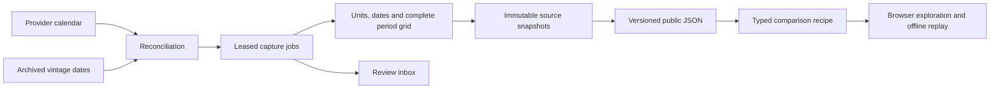

# Release and revision laboratory

The public laboratory connects a source release to an immutable capture, a revision comparison, a saved research recipe and an independently replayable result. It shares the workbench's source adapters, immutable store, exact calculations, leased jobs and recovery tools. Public visitors need no account.

## Product workflow

1. Open the [revision study](https://global-liquidity-credit-tracker.vercel.app/research/lab). Move the reference level and inspect any of the 24 monthly observations.
2. Follow the two changed input levels into their dated source responses. Open the month as a typed research recipe.
3. Inspect the recipe, change captured information dates or the observation range, and run the comparison. Save it in the browser or share the pinned link.
4. Download the replay manifest. Import it in another browser or run the standalone verifier offline.
5. Open the release monitor to inspect the three scheduled tracks, future calendar dates, completed captures and items awaiting verification.



## Source and publication contracts

| Series | Provider release | Raw measure | Public transformation |
|---|---|---|---|
| PAYEMS | Employment Situation, FRED release 50 | Thousands of persons, monthly, seasonally adjusted | Current level minus preceding month's level within the same vintage |
| INDPRO | G.17, FRED release 13 | Index 2017=100, monthly, seasonally adjusted | Same-vintage monthly percentage change |
| A191RL1Q225SBEA | GDP, FRED release 53 | Percent change from preceding period, quarterly, seasonally adjusted annual rate | Published growth rate |

The source association is checked against FRED on every inventory refresh. [Calendar dates](https://fred.stlouisfed.org/docs/api/fred/release_dates.html) describe provider expectations; they do not establish archive availability. [Vintage dates](https://fred.stlouisfed.org/docs/api/fred/series_vintagedates.html) identify changes or new observations and exclude unchanged releases. A calendar date with no listed vintage is reported as unchanged or awaiting availability, without inventing a release time.

Every poll re-enumerates the bounded three-series horizon beginning June 1, 2026. Missing successful captures are queued idempotently. The two newest vintages are rechecked once per 12-hour poll slot. New dated revisions are additive; conflicting responses for an existing information date are retained as raw evidence and held for review. An expired worker cannot publish through another worker's lease.

Before committing a snapshot, the collector verifies the series identity, unit, frequency, seasonal adjustment, requested information date, page counts, unique period grid, non-null values and last published period from vintage-specific metadata. FRED's returned real-time day bounds availability requests after UTC midnight. Quarterly requests start on a quarter boundary. The actual source run exposed both of these date-boundary requirements.

Only committed snapshots whose dates occur in the archive inventory appear as release events. A fixed study comparison date between releases cannot become a new release date. The public feed carries up to six verified vintages per track, alongside an explainable inbox. Older publication bundles remain addressable for shared recipes.

Primary documentation and source policies were checked on September 12, 2026 UTC. Attribution is provided to [BLS](https://www.bls.gov/bls/linksite.htm), the [Federal Reserve Board](https://www.federalreserve.gov/disclaimer.htm) and [BEA](https://www.bea.gov/about/policies-and-information). The public collector's allowlist contains these three government series. It does not export private workspaces or source credentials.

## Fixed point-in-time study

The [study specification](../../config/research/payroll-revision-study.json) is stored at `config/research/payroll-revision-study.json`. The public collection contains 25 verified snapshots and 51 original response bodies. It covers every month from January 2023 through December 2024 and fixes the comparison information date at September 11, 2026.

Initial dates come from FRED's `output_type=4` [initial-release history](https://fred.stlouisfed.org/docs/api/fred/series_observations.html). Each initial level is cross-checked against a full snapshot on that exact date. Monthly growth always subtracts the preceding month's level from the same vintage. All 24 first estimates also match the independently read [BLS first-estimate table](https://www.bls.gov/web/empsit/cesnaicsrev.htm). Later revisions include benchmark and seasonal-factor changes, as described by [BLS's estimation method](https://www.bls.gov/opub/hom/ces/presentation.htm).

| Outcome | All 24 months |
|---|---:|
| Mean initial monthly growth | 238.708 thousand jobs |
| Mean revised monthly growth | 165.583 thousand jobs |
| Mean revision | -73.125 thousand jobs |
| Median revision | -70.5 thousand jobs |
| Mean absolute revision | 79.542 thousand jobs |
| Largest absolute revision | 194 thousand jobs |
| Upward / downward / unchanged revisions | 4 / 20 / 0 |
| Classification changes at 0 / 100 / 200 thousand jobs | 0 / 6 / 9 |
| Excluded observations | 0 |

The three reference levels and full set of outcomes were specified before calculation. This is an exploratory historical study. Its fixed latest-vintage comparison is not a contemporaneous platform publication or an estimate of investment performance. The study does not select observations by revision magnitude.

The 95% circular moving-block resampling intervals use 5,000 replicates, a fixed seed, and both 3- and 6-month blocks. The mean-revision intervals are -98.209 to -47.498 thousand jobs and -101.126 to -47.624 thousand jobs, respectively. The UI and manifest also report intervals for absolute revisions and classification changes at every planned threshold. They describe stability within this small, consecutive-month sample. Common benchmark updates can affect the whole cohort, so these intervals do not establish a future revision distribution.

Missing initial history remains an explicit excluded row in the study draft; it is never replaced with a current observation. Block resampling is unavailable across a broken cohort. The fixed public study is held until all planned observations are available, while its draft evidence object remains inspectable.

## Recipes, attribution and planner

`research-comparison/1` pins a publication digest, series, two snapshot digests, an exact calendar range, approved transformation, reference and strict comparison rule. The engine does not fill missing periods or infer an unrecorded information date. Reference classification uses exact source decimals before display rounding. Payroll revision attribution is additive. Percentage-change attribution averages both orders of updating the two inputs, so the components reconcile without depending on an arbitrary order.

The finite-language planner accepts a supported series, month and either two archived dates or the collection's first/latest captures. In the fixed study, first resolves to the verified initial-release snapshot. In a rolling release collection, first means the earliest retained capture; an initial-estimate claim requires the study or explicit evidence. Unsupported questions, intraday cutoffs, missing history and unapproved operations are rejected before a recipe executes. The public page uses no external model service.

The [reserved evaluation](evidence/release-planner-evaluation.json) contains 36 prompts: 14 factual comparisons with 54 exact source-input citations and 22 unsupported requests. Expected values are independently calculated from the original response bodies. This evaluates the supported grammar and two captured collections. A precision-boundary regression also checks an industrial-production reference between the exact result and its rounded display value.

Saved recipes are local to a browser. Share links pin immutable publication IDs; the publisher retains prior bundles so a later refresh cannot silently replace their inputs. Replay manifests contain the typed recipe, result, snapshots and original response bytes. The standalone verifier imports no application modules and makes no network requests:

```bash
python3 scripts/replay_release_lab.py research-replay.json
python3 scripts/replay_release_lab.py frontend/public/research/lab/study.json
```

The shipped seeds are passed as raw JSON text from the server component and parsed in the client. A real browser check found that Turbopack 16.3.5 changed seven long decimal literals when importing the JSON as a module, invalidating the publication hash. The corrected path preserves the original numeric text. Actual browser exports now match the source bundle and pass independent Python replay.

## Operations and recovery

The existing GitHub Actions data job remains the sole source collector. It publishes through the existing `gh-pages` branch and Vercel application, with no additional hosted service. Its dedicated `public-release-lab` workspace is distinct from personal research.

- Restore the prior `state/release-lab` backup and `release-lab.required` marker before collection. A missing published backup or regressed snapshot count stops publication.
- Restore `latest/research` so old publication URLs survive the next export. The dashboard exporter clears its output directory, so this restoration runs afterward.
- Reconcile provider calendars and vintage inventories, run at most 18 capture jobs, and independently replay the complete public bundle before updating `research/index.json`.
- Preserve a failed discovery's last complete inventory. Surface failed capture checks in the inbox while keeping verified observations available.
- Create and verify the next backup. Publish the JSON, immutable bundle archive and backup together in one Git commit. The workflow serializes publication runs.

Local equivalents use the existing locked environment and an environment-supplied FRED key:

```bash
uv run python scripts/publish_release_lab.py --backup data/public-release-backup
uv run python scripts/publish_release_lab.py \
  --store data/recovered-release-lab \
  --restore data/public-release-backup \
  --prior-public data/export/latest/research \
  --output data/recovered-export \
  --backup data/recovered-backup
```

The bounded real-source exercise produced the study and release collection, held incomplete quarterly candidates, recovered them after correcting the request boundary, then successfully restored and republished the public state. Recorded-response tests cover metadata drift, incomplete and duplicate observations, changed dates, page errors, discovery outages, same-vintage conflicts, concurrent duplicate ingestion and backup recovery.

No production database migration is required. The public deployment reads JSON; SQLite control state is restored inside the scheduled runner. The local private API remains independent.

## Measured workload

The [workload receipt](evidence/release-lab-benchmark.json) records its timestamp, Python/OS/architecture, CPU count, dependency lock and code hashes. Four leased workers execute 24 pinned payroll calculations against 13 captured snapshots. Each run queries two real observations, calculates a monthly difference and commits an immutable result. All 24 results are checked against the study.

The measurement includes the durable claim/query/calculation/commit path. It excludes source network calls and loading the captured inputs. Per-job latency excludes time waiting in the queue; total elapsed time includes completion of all jobs. This is a local concurrency measurement on the recorded workload. It does not extrapolate to hosted source-ingestion throughput.
